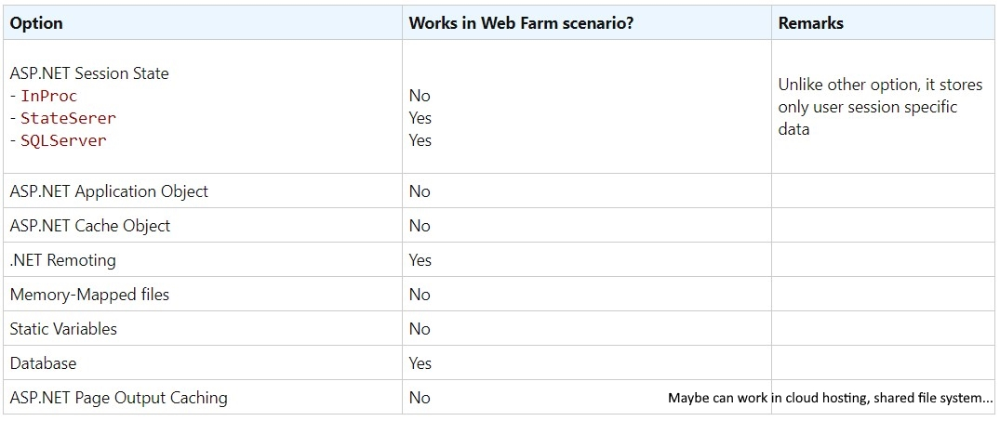

# Aspnet-DiskOutputCacheProvider
A persistent file system disk cache for ASP.NET

## Introduction

Summary of: https://www.codeproject.com/Articles/12097/Cache-Management-in-ASP-NET

Use different terms for explaining the same concept, i.e., managing data. 
Some people refer to it as state management and some others refer to it as cache management. 
I like the word "cache". But conceptually, there is no difference between these two.

Now let's discuss different aspects of cache management (or state management) in ASP.NET.

Although cache management is not an issue in Windows applications, it has always been a challenge in the web environment. 
Since HTTP is a stateless protocol and a web server doesn't recognize users between different requests, 
it becomes very important for us to recognize a particular user between different requests and also store data so that it can be re-used between different requests. 
ASP.NET provides many features for storing data both in the client (browser) and the server (web server) sides, but sometimes we get confused with when to use what. 
In ASP.NET, we come across features like Session, Application and Cache objects, but it is important for us to understand the difference between them in order to effectively use them in web applications.

## Background
In this article, I will touch upon the different cache management options available in ASP.NET. 
In a web application, sometimes we require to store data in the server side to avoid costly data retrieval operation from data stores and time consuming data formatting logic to improve application performance as well as to re-use the same data in subsequent requests across users, applications and machines. So, to achieve this, we need to store (cache) data in the server side.

Caching helps us to achieve three important aspects of QoS (Quality Of Service):

* Performance - Caching improves application performance by minimizing data retrieval and formatting operations.
* Scalability - Since caching minimizes data retrieval and formatting operations, it reduces the load on server resources thus increasing the scalability of the application.
* Availability - Since the application uses data from a cache, the application will survive failures in other systems and databases.

## ASP.NET Application Object

ASP.NET provides an object called Application object to store data that is accessible to all user requests. 
The life span of this object is tied to the application and it is re-created every time the application starts. 
Unlike ASP.NET Session object, this object is accessible to all user requests. 
Since this storage is created and maintained in an application domain space, this should not be used for data storage in a web farm scenario. 
This option is very useful to store data like the application metadata (CONFIG files data) that can be loaded to the Application object during application start up and can be used during the life of the application without reloading it every time for each user request. But if there is a requirement to invalidate the cached data whenever there is any change to the CONFIG files while the application is running, this option should not be used as it doesn't provide any feature to expire the cached data. So in this case, other options like the ASP.NET Cache object should be used, which is explained below.

## ASP.NET Cache Object
ASP.NET provides a key-value pair object - the Cache object which is available in the System.Web.Caching namespace. 
The scope of it is the application domain and the life span is tied to the application. Unlike the ASP.NET Session object, this object is accessible to all user requests.

Although both Application and Cache objects look the same, the key difference between them is the added features provided by the Cache object like the expiration policies and dependencies. It means that the data stored in the cache object can be expired/removed based on some predefined time limit set by the application code or when the dependent entity gets changed whereas this feature is not available in the Application object.

Let us discuss the different expiration policies and the dependencies that are supported.

### Dependency
Dependency means that an item can be removed from the cache when a dependent entity gets changed. So a dependent relationship can be defined on an item whose removal from the cache will depend on the dependent. There are two types of dependencies supported in ASP.NET.

* File dependency - This provides an option to remove an item automatically from the cache whenever a disk file changes. 
* Table dependency - When table content changes, only for Microsoft SQL Server, you need administrative privilegies to setup dependency. 

Example: Let's say in my application, I am using an XML file to store error details (error number and error message mapping) which is used to retrieve an error message for a given error number at runtime. So instead of reading the file from the disk each time I need an error message, let's say I decide to load it once at application startup and store it in the ASP.NET cache for further use. So, if I need to change the CONFIG file to add new error messages or change some of the existing error messages while the application is running, then what will happen to my cached data? Do I need to stop the application and start it again to reflect the file changes in the application? The answer is no. The cache data can be invalidated whenever the file changes by using the File dependency option.

### Expiration Policy
Expiration policy sets the policy for how and when an item in the cache should expire.

- Time based expiration - Time based expiration provides an option to expire an item in the cache at a predefined time. The expiration time can be set as absolute time like 31st October 2005 12:00 or sliding time, i.e., relative to the current time when the item is accessed.

## .NET Remoting
The .NET remoting singleton object shares the same instance with multiple clients so singleton objects can be used to store and share data between different client invocations. Since .NET remoting can be used outside the process and machine, this option is very useful when we want to cache data and share it across servers and users particularly in a web farm scenario. In this approach, we can store the data as member variables of singleton remoting object and provide methods to read and save data. But while implementing this, we need to ensure that the remoting object used as cache is not destroyed by the garbage collector. For that, we will have to set the remoting cache object's lease period to infinite so that the lease period never times out. We can do that by overriding the InitializeLifetimeService method of MarshalByRefObject and return null from this method. But the only issue with this approach is performance. As the analysis says, the performance is very poor in this approach when compared to other approaches. Anyways, it is up to the application designers/developers to analyze different options and use the best one that suits the requirement.

## Memory-mapped Files
You all know what a memory-mapped file is. It is basically about mapping a file on disk to a specific range of addresses in the application's process address space. This option allows different processes to use the same data by increasing the application performance. As using memory-mapped file is not very popular among .NET developers, I would personally not suggest this approach as implementing this involves a lot of complexities and also .NET Framework doesn't support this. But if anyone is very much interested in using this approach, then they will have to develop their own custom solution as per their own requirement.

## Static Variables
We use static variables for storing data or objects globally so that they can be accessed during the life of the application. Similarly, in ASP.NET, we can use static objects for caching data and we can also provide methods to retrieve and save data to the cache. As static variables are stored in the process area, performance wise it is faster. But since it is very difficult to implement expiration policies and dependencies in case of static variables, I generally prefer ASP.NET cache object over this option. Another problem is that the custom static cache object has to be thread-safe which has to be implemented carefully.

## Database
We can also use a database for storing data and sharing the data across users and machines. This approach is very useful when we want to cache large amounts of data. Using this approach for storing small amount of data is not a good idea because of performance. For storing small amount of data, we should go for other ASP.NET in-process caching mechanisms. As the data needs to be stored in a database, all the objects need to be XML serialized so that it is easier to store and retrieve. We can also use other types of serialization formats available in the .NET Framework.

- An ASP.NET Core IDistributedCache provider backed by SQLite: https://github.com/neosmart/AspSqliteCache

## ASP.NET Page Output Caching
Sometimes in our application, in some pages, the output generally doesn't change for a specific period of time. For example, in a HR website, the salary details of an employee don't change very frequently and it changes only once in a month. Generally, it changes only on the 1st day of every month. So during a month, the salary details page will show the same details for a particular employee. So in this case, isn't it a good idea to cache the page somewhere in the server to avoid business calculation processing, calls to database and page rendering logic every time the employee wants to see his salary details. In my opinion, Yes! It is a very good idea. To achieve this, ASP.NET provides a feature to store the output of a page in the server for a specific period of time. It also provides features to store a fragment of a page which is known as Page fragment caching. 

## Client Side Cache Management
Sometimes we may need to cache data or pages in the client side to improve application performance. 
Using this mechanism reduces the load on server but this mechanism has some security issues as we cache the data in client side. 

### Cookies
Cookie is a client-side storage that is sent to the server for each request and also received as response back from the server. 
Because of its size limitation, it should be used for storing small amount of data. 
Expiration policies can be set for cookies to invalidate the items after a certain period of time. 

### ViewState
ASP.NET ViewState is a concept only in Webforms (not MVC) where the data related to the pages and controls are stored in the generated page (client side). 
which retains the values across multiple requests to the server. 
ViewState is implemented internally as encrypted hidden fields in ASP.NET.
ViewState should not be used to store large amounts of data as it is passed to the server for each request.

### Hidden Fields
Hidden field is similar to any other control in a page but the visible state of this control is always false. 
Like ViewState, we should not use it for storing large amounts of data.
Hidden frames can be used to cache data in the client side, but note that hidden frames are not supported by all Internet browsers.

### Internet Browser Caching
Internet browsers provides caching mechanism to cache pages in the client side. 
This can be set using the EXPIRES directive added to the header of the pages or by setting it manually in Web Server.
We should use this option for caching static pages, scripts, css and images in the client side.

---
Made with ❤️ by [Javier Cañon](https://www.javiercanon.com).
